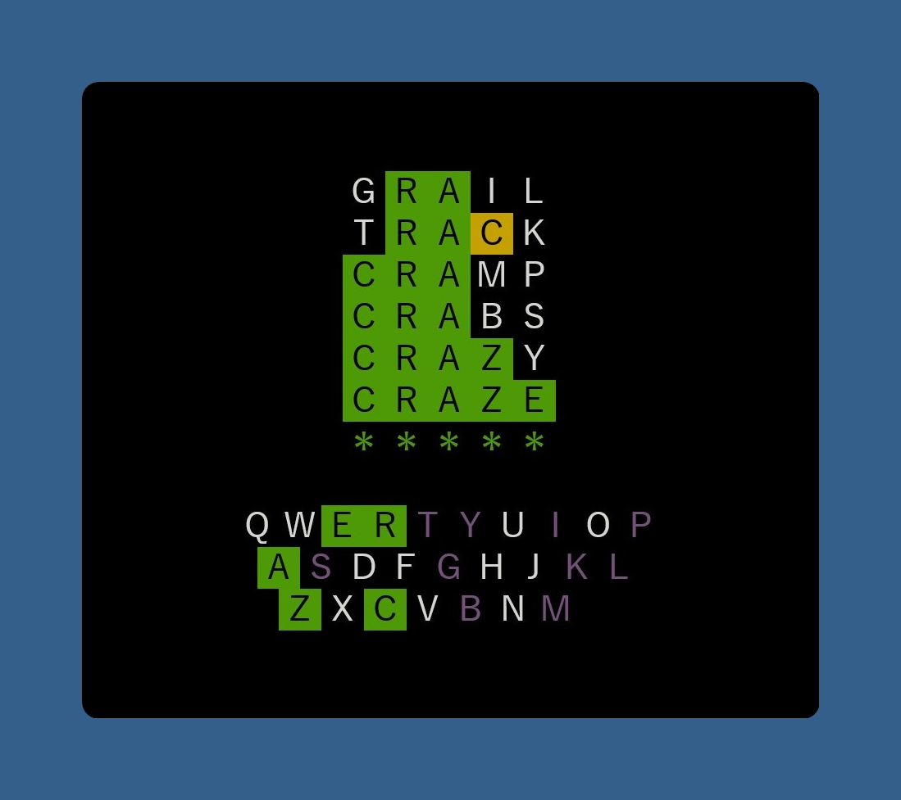

# wordle-clone
Wordle clone in the terminal (in Perl or Raku)

## NOTES

I'm using the SOWPODS word list, which is the word list used in tournament Scrabble in English-speaking countries except the USA, Canada, Thailand and Israel. Yes, this word list has a lot of odd and it would be a good idea to whittle this list down, but I leave that as an exercise for the user.
